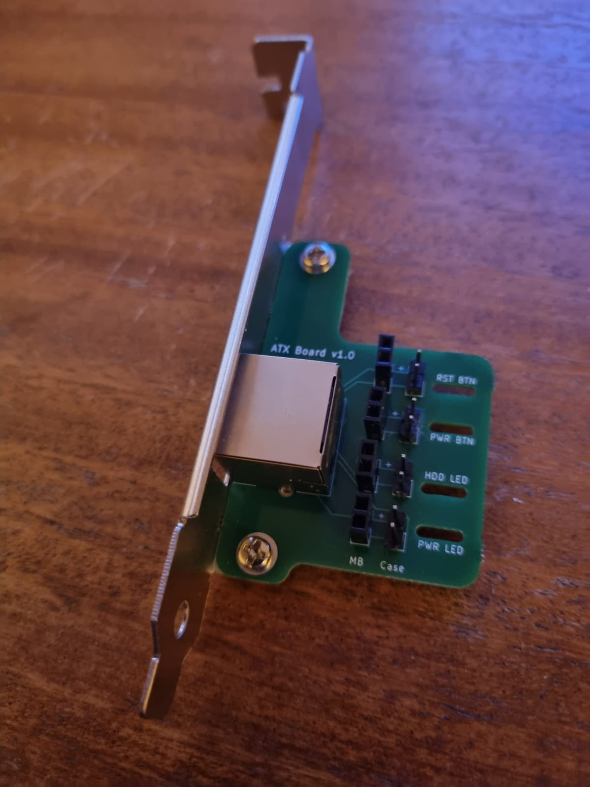
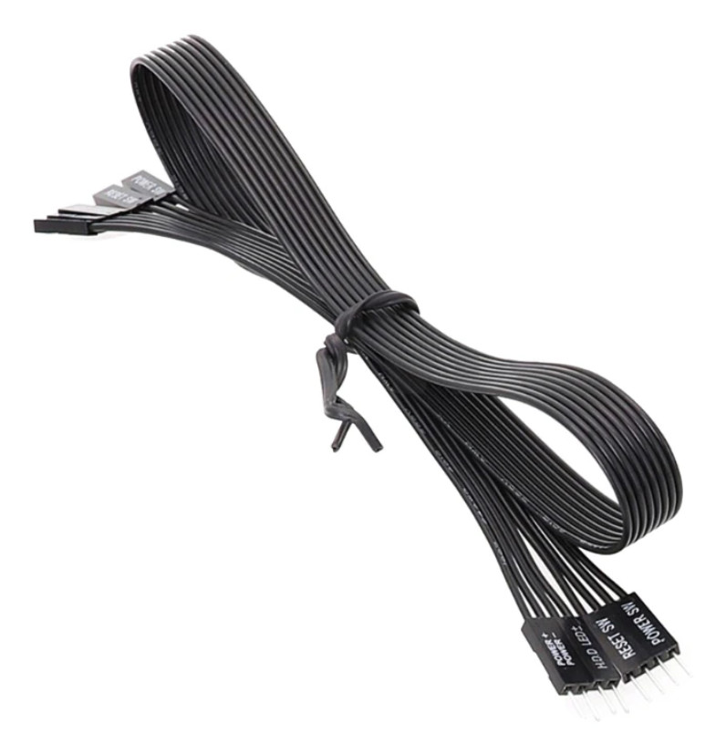
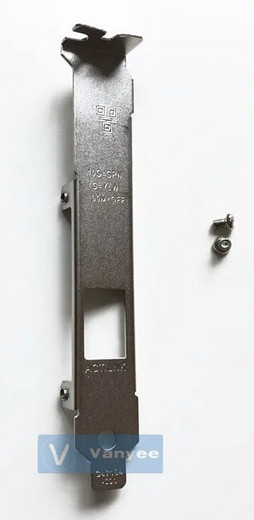
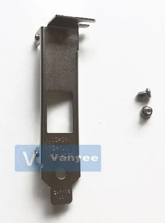

##### ATX breakout adapter for insertion inside case of managed device (PC / Server).

Compatible with pinout of [PiKVM ATX control board](https://docs.pikvm.org/atx_board/#pinout) enabling connection to managed devices ATX header, and its case controls (where appropriate).

The board is **self-assembly** and provides two banks of 4x 2-pin connectors for motherboard (MB) and case connectivity respectively. The connector rows are labelled with the ATX header / case connector that they relate to - Reset button (RST_BTN); Power button (PWR_BTN); Hard drive activity LED (HDD_LED) and Power LED (PWR_LED).

In reality the MB and Case banks are 1:1 connected so can be connected to either ATX header or case cables provided that compatible 2-pin connectors are installed. However to reduce the risk of mix-up during installation my preferred approach has been to use:

- Male connectors to support case connectivity (if this is to be used), as case cables are normally provided with female plugs on their ends.

- Female connectors to support ATX header connectivity.

  - Note - this requires the use of Male-Female Dupont ribbon cable (or similar) to allow connection to the male headers on the motherboard.

  - My preference has been to use a PC motherboard switch extender for this - mainly as the ends are labelled, which reduces installation risk. However I also think they look better than multicoloured ribbon cable. They are more expensive though!

    

    
    

The board has been designed to work with the metal brackets for the single port Intel X540-T1 NIC which are available in both full height and low profile variants:

|  |  |
| --------------------------------------------- | --------------------------------------------- |

These are available from a number of vendors (which keep changing).

At the time of writing the cheapest available was from a vendor on AliExpress:

- [Full Height](https://www.aliexpress.us/item/3256804856153513.html?spm=a2g0o.productlist.main.3.d777281cjyfICR&algo_pvid=43fd2ca8-fdaa-4724-b255-38cb94d674ff&algo_exp_id=43fd2ca8-fdaa-4724-b255-38cb94d674ff-1&pdp_npi=4%40dis%21GBP%211.60%211.60%21%21%2113.94%2113.94%21%40211b441e17135936427566107e7dde%2112000032784801700%21sea%21US%214412103182%21&curPageLogUid=pC5GEaC1rl1W&utparam-url=scene%3Asearch%7Cquery_from%3A)
- [Low Profile](https://www.aliexpress.us/item/3256805210264567.html?spm=a2g0o.productlist.main.5.d777281cjyfICR&algo_pvid=43fd2ca8-fdaa-4724-b255-38cb94d674ff&algo_exp_id=43fd2ca8-fdaa-4724-b255-38cb94d674ff-2&pdp_npi=4%40dis%21GBP%211.60%211.60%21%21%2113.94%2113.94%21%40211b441e17135936427566107e7dde%2112000032895051446%21sea%21US%214412103182%21&curPageLogUid=1LfviPZIJG9c&utparam-url=scene%3Asearch%7Cquery_from%3A)

