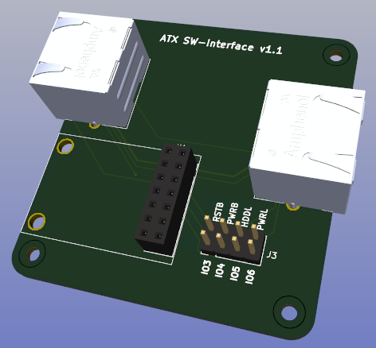

# ATX Switch Interface board

 

    
    

Basically this simple board just takes the I2C outputs and power from the CP2112 debug board (connected to PiKVM via USB), together with the active GPIO pins from the ATX port, and maps these to the pin configuration used by the ATX Switch.

Consists of:

- PCB
- 2x RJ45 connectors
- 1x 7x2row female (socket) connector - 2.54mm
- 1x 4x2row male (pin) connector - 2.54mm
- CP2112 debug board (with 7x2row pin connector soldered to underside)
- 2x M2.5 11mm brass standoffs
- 4x M2.5x5mm flat head bolts

