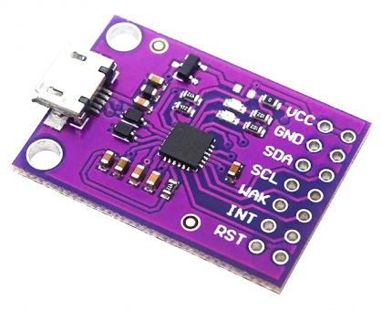
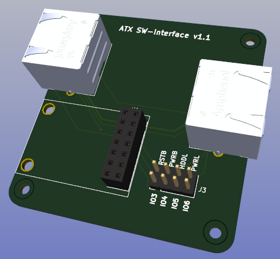
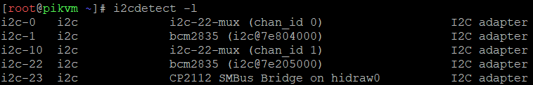
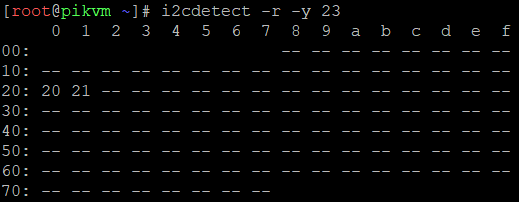

# ATX Switch Interface

## Design Criteria

After producing the ATX Switch / DIY PiKVM combination for my home environment, I revisited whether it would be possible to use the ATX Switch with one of the standard PiKVM's.

The main interface to the ATX Switch environment is the relevant GPIO pins, and I2C. However the PiKVM devices were fixed units - with no expansion capability unless you used existing ports, or 'hacked' the units (which most people won't want to do!).

Therefore it was necessary to determine if the provided ports could be utilised / re-purposed.

The standard ATX port on the PiKVM has a fixed pinout, but the relevant GPIO pins could be mapped externally to the configuration used by the ATX Switch.

Which left the need to provide an I2C interface.

The only other ports available for use on the PiKVM were the USB ports, so it was decided to look at providing a USB<-->I2C interface.

A number of USB<-->I2C adaptors were reviewed based on functionality / availability / support / cost .....

It was determined that the CP2112 HID USB to SMBus / I2C Bridge had kernel support within Arch Linux[^1], and was available in a relatively inexpensive 'debug board' package:

 

    
    

This board was tested in the ATX Switch environment and supported the required functionality, with minimal code changes.

A simple board was then constructed incorporating the CP2112 board and a pair of RJ45 connectors, to provide the interface between the PiKVM and ATX Switch.

 

    
    

>[!NOTE]
>
>The CP2112 board also supports GPIO expansion, although this capability was not specifically required for the purpose of this interface adaptor. It may be possible however for this approach to be used to control the ATX functionality (via the ATX Switch) by remapping GPIO pins in the PiKVM code. 
>
>Accordingly four of the CP2112 board GPIO pins (3, 4, 5, 6) have been configured so that they can be jumpered to ATX Switch functionality (RSTB, PWRB, HDDL, PWRL) if desired[^2].
>
>$\color{red}{\textsf{THIS FUNCTIONALITY HAS NOT BEEN TESTED!!!}}$

## Required Parts

- [3D printed case](./Case/README.md)
- [ATX Switch Interface board](./Board/README.md)
- CP2112 debug board
- 4x M2.5x10 countersunk bolts[^3] 
- USB-A to micro-USB cable
- 2x 8-wire Ethernet cables

## Installation

Connect the ATX Switch Interface to the PiKVM (as per the overview diagram in the introduction)

- 8-wire Ethernet cable between the ATX port on the PiKVM and the ATX port on the Interface
- USB cable between spare port on the PiKVM and the micro-USB port on the Interface

Connect ATX Switch Interface to the ATX Switch using an 8-wire Ethernet cable.

Start the PiKVM and determine the BUS ID of the CP2112 controller in the ATX Switch Interface by running the command:  **i2cdetect -l**

The output should be similar to:

 

    
    

In the above we can see that the CP2112 controller is on bus 23

Verify that the CP2112 I2C controller is working and can see the attached ATX Switch(es) by using the command :  **i2cdetect -r -y 23**  (substitute the bus ID determined above for the last value, if necessary)

>[!NOTE]
>
>The CP2112 module is unable to use the I2C quick write capability, so the **-r** parameter must be used to get proper output.

The output should be similar to:

 

    
    

Here we can see that there are 2x ATX Switches configured at addresses 0x20 and 0x21

Update the value in the 'i2c_bus_id' field in the ATX Switch environment configuration file (**atx_switch_initialisation.yaml**) to reflect the bus ID determined[^4]

Configure the rest of the ATX Switch environment within the PiKVM (using the approach defined in the DIY PiKVM [Scripts](../DIY_PiKVM/Scripts/README.md) area).

>[!NOTE]
>
>Ensure that the PiKVM kernel has been updated to include CP2112 support by running **pikvm-update**

###### Footnotes

[^1]: Initially it was determined that the PiKVM kernel had not been built with CP2112 support included, but Max kindly reconfigured the kernel to re-instate support - my thanks for this.

[^2]: If this approach were to be used then make sure that nothing is connected to the ATX port connector (RJ45) on the interface unit - as the ATX port on the PiKVM will still be physically connected to the assigned GPIO pins on the Raspberry Pi.

[^3]: Can use screws but will need to reduce size of affixing hole in case top

[^4]: The original ATX Switch environment scripts had the 'standard' Pi4 internal bus ID (=1) hardcoded in two locations. These could be manually changed quite easily, but it was decided to include the bus_id as a configurable item and the code was changed to use this value from the configuration file.

