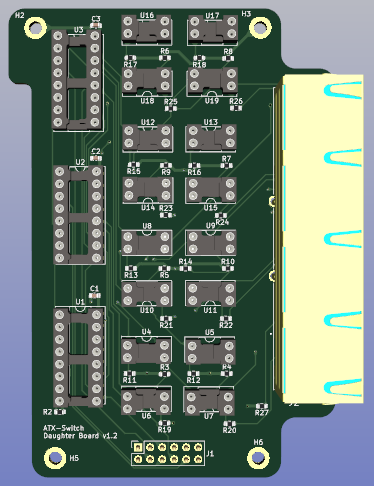

# Daughter board

This board is a mirror of the de/multiplexor, managed device isolation, and 4-port connector functionality of the Main board.

It was designed to sit above the Main board, with the same port orientation, and bridged via the 12-pin (2x6) connector. 

It is attached to the main board via 4x [M2.5 18mm brass standoffs](https://www.aliexpress.com/item/1005003320815605.html) (with associated [M2.5 6mm bolts](https://www.aliexpress.com/item/1005003294513501.html)), and is shaped to allow for the support posts in the 3D printed case. All mounting holes are M2.5 and align with the matching holes on the Main board.

The board was also designed to enable access to the jumpers on the Main board once it was attached.

As per the Main board the isolation components can be either SSRs or optocouplers.

Again sockets were used for test purposes and can be omitted from board creation.

### Daughter board presence check

The only additional functionality that this board provides is support of a daughter board presence test. This consists of the ability to use the 2nd channel on the third CD4052B to check for a high ('1') signal DB_test line when the second RJ45 port of the daughter board is selected. Basically each of the RJ45 ports on the daughter board are selected sequentially and the value returned via from DB_test (via I2C) is read. All ports should read low ('0') apart from the second port, so the sequence read should be - 0,1,0,0.

In theory you don't have to check all of the ports - could just verify that port2 on daughterboard returns ‘1’, but checking that one of the others returns ‘0’ may be a useful sense check. Ensure that the selected port value is also returned for verification. 

May be worth doing multiple reads on port 2 (or the full sequence) just to ensure that you aren’t getting a floating value. i.e. 10 or 20 consecutive reads with same value consistently returned gives confidence – this only gets done during initialisation so isn’t really any particular overhead.

As mentioned in the main board description, if I2C_HDD jumper is set to enable reading of HDD_LED status via I2C then the daughter board test functionality will not work as the 2nd channel on the third CD4052B will not be enabled.

