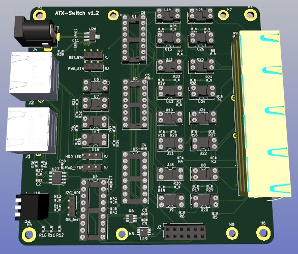

# Main board

## Physical aspects

The size of the PCB was determined from a number of factors:

- 100mm x 100mm is the cut-off point for cheaper boards from a number of PCB manufacturers
- It gave a larger space to work with while I was learning how to use Kicad.
- I'd decided to use Through Hole (TH) components[^1] for ease of hand soldering, and they tend to be larger than SMD devices.
- It worked well with the size of the larger components (primarily the 4-port RJ45 connector).
- It also worked well with the 3D printed case.

I could have made it smaller (particularly after the design had been tested), but I was happy with the result so it stayed as it was[^2].

The original boards were 2-layer and worked fine, however when I produced the final iteration the price of 4-layer boards wasn't that much more (in the quantities I was after) - so I decided to produce a 4-layer for the experience, and because it looks neater.

The use of sockets was to enable pin compatible replacements to be tested, particularly w.r.to SSRs vs. optocouplers (but also for different manufacturers variants / equivalents). It also makes it easier to replace a component if one is faulty. The intention was to solder the components directly to the PCB once a final decision had been made on component choice - but by the time I'd finished testing I had a few boards that were already socketed, so I just used them.

The RJ45 connectors were chosen to have integral LED's which allowed them to be used for indication purposes:

- In the case of the 4-port RJ45 connector the green LED indicates if the port is selected (the amber LED is not used);
- In the case of the single RJ45 that is used for connecting to the DIY PiKVM (the one nearest the address switch) the green LED indicates whether there is power to the ATX Switch unit, and the amber LED indicates if there is an active connection to the DIY PiKVM.
- Neither of the LEDs on the daisy-chain (expansion) single RJ45 connector are used.

A barrel port power connector was chosen as it is simpler, more robust to install / operate.

A 3-pole piano switch was chosen for the address selector because it is easier to operate from outside the case, and just looks neater[^3]. The default I2C address for the ATX Switch is 0x20 - all address selection switch levers positioned at '0'.

The mounting holes in the corners are M3 to match with the mounting posts in the 3D printed case(s), and the remaining mounting holes are M2.5 to allow for attaching the [daughter board](../Daughter_board/README.md).

## Active components

The list of all components is provided in the Bill Of Materials (BOM) included with the production files for the board. 

**MCP23008 I2C I/O expander** - in addition to the addressing capability mentioned previously, this device provides for an additional 8x GPIO pins to extend the DIY PiKVM capability. These are configured to enable:

- selection between main board and daughter board operation (or neither when the associated ATX Switch is not being addressed)
- selection between the 4-ports that are connected to managed devices
- I/O capability for I2C based ATX operations
- test for presence of daughter board (if environment configured correctly)

**CD4052B 4:1, 2-channel general purpose de/multiplexor** - this provides the mechanism for splitting the PiKVM assigned (GPIO) ATX pins to each of the ports via the isolation components. These latter can be either Solid State Relays (SSRs) or optocouplers depending on how much the user wants to pay vs. their concern over being able to wire up the managed device correctly (polarity of the ATX header on the motherboard).

There are three CD4052B components on the board: two of these enable switching the 4x ATX GPIO pins between the managed devices; whilst the third enables the green LED on the RJ45 port for the selected managed device to be lit, in order to provide a visual indication of which port is active.

**Isolation components** - there are two main areas of isolation on the board: 

- Connectivity to the DIY PiKVM - which is divided into:
  - I2C isolation using an **ISO1540 low-power bidirectional I2C isolator**
  - ATX GPIO pin isolation using **LTV-817** optocouplers
    - If compatibility with the other isolators on the board was required (single component type) then the selected SSRs could be substituted here at increased cost.
  - These also provided a signal boost to the downstream ATX Switches.
- Connectivity to the ATX Adapters on the managed devices.
  - The recommended isolator (from the PiKVM v2 design) was the G3VM-61A1 MOSFET relay, which is an SSR - but is relatively expensive, and for a while was suffering supply issues.
    - Alternative pin-compatible SSRs were available (a number of which were considered) but the one selected was the **KAQY214**.
  - A much cheaper approach however was to use an optocoupler. A number of products that were pin-compatible with the SSRs were considered, but the chosen component was the **LTV-817-C**. *This was the approach I used for most of my boards, as I was comfortable with installing the ATX Adapter boards correctly*.

## Configuration options

$\color{purple}{\textsf{Choosing between GPIO and I2C operation of ATX function}}$

The board was primarily designed to enable extension of the existing PiKVM ATX functionality (using the assigned GPIO pins) to multiple managed devices. However, the capability to operate these ATX functions via I2C was also added - thus reducing the number of required connections to the PiKVM to four (4): Ground; +3.3v; I2C SCL; and I2C SDA.

In order to support this capability a set of 3-pin plug connectors were added to the  board (J7, J8, J9, J11) and were labelled with their associated ATX operation.

Connecting a jumper between the middle pin and 'RJ' on a function bridges the associated optocoupler from the relevant DIY PiKVM GPIO pin to the selected managed device.

Connecting the jumper between the middle pin and the label bridges the associated GPIO pin from the MCP23008 (which can be addressed via I2C) to the selected managed device.

**Default** - *connect all jumpers between middle pins and 'RJ'*

$\color{purple}{\textsf{Ability to test for presence of Daughter board}}$

This was an option that was originally provided to allow the presence of a daughter board to be determined by the ATX Switch code during DIY PiKVM initialisation. This capability was deprecated when it was decided to include HDD LED into I2C operations[^4], and a jumper was included to allow selection between DB_test and I2C_HDD operation. As current functionality does not support I2C based ATX operations through the PiKVM WebUI this jumper should be connected between the middle pin and DB_test.

**Default** - *connect middle pin to DB_test*

## Optional parts

There are a number of components on the ATX Switch main board that can be considered optional if desired (and if you are really trying to minimise cost / effort) at the expense of flexibility:

- If you only want 4-port ATX Switches then you can omit the daughter-board connector (J3) on the main board.
- If you are only going to use GPIO ATX operations then you can hardwire the selections rather than using connector pins and jumpers.
- The address switch can be replaced by a dual 3-pin connector (potentially right-angled) and jumpers, or the address could even be hard-wired.
- If only one Switch is required (either 4-port or 8-port) then can omit the 2nd (single) RJ45 connector that is used for daisy-chaining switches together. Note however, that the 3D printed case will still have an opening for the connector unless you change it.

To be honest though I didn't feel that the savings were worth the loss in flexibility.

The main savings relate to the use of optocouplers rather than SSRs, provided that you are comfortable making the correct connection on the motherboard of the managed device. 

###### Footnotes

[^1]: For the most part, although there were a few components that were only available in SMD, which I got assembled by the PCB manufacturer.
[^2]: I even did a Surface Mount Device (SMD) based design for all of the active components, which again could have been somewhat smaller and allowed more use of PCB manufacturers assembly capability - but there were quite a lot of connectors that were needed and were cheaper in TH variant. Additionally some active components (e.g. MCP23008) were a lot cheaper in TH than their SMD equivalents - at least when I started this (it may have changed now). Also I believed (perhaps wrongly) that most people would find it more difficult to solder SMD components than TH.   Finally, if you want to get the PCB manufacturers to assemble the full board for you then you need to either: select all components from what they stock; OR arrange for your own components to be shipped to / be stored by them. I was doing this as a hobby, not as a business!
[^3]: An alternative could have been to use a right-angled two row, 3-pole connector with jumpers - but this would be more fiddly to configure and would run the risk of losing the jumpers.
[^4]: It was uncertain whether the polling frequency for HDD status of a managed device would be practical via I2C, or whether this would have any adverse impact upon other PiKVM operations. Until a mechanism to enable ATX operations via I2C from the PiKVM WebUI is produced / tested then this cannot be confirmed. I suspect that it will be fine, therefore decided to include the option to enable I2C_HDD - however, due to the availability of GPIO pins on the MCP23008 it was necessary to dual purpose the daughter board test pin.