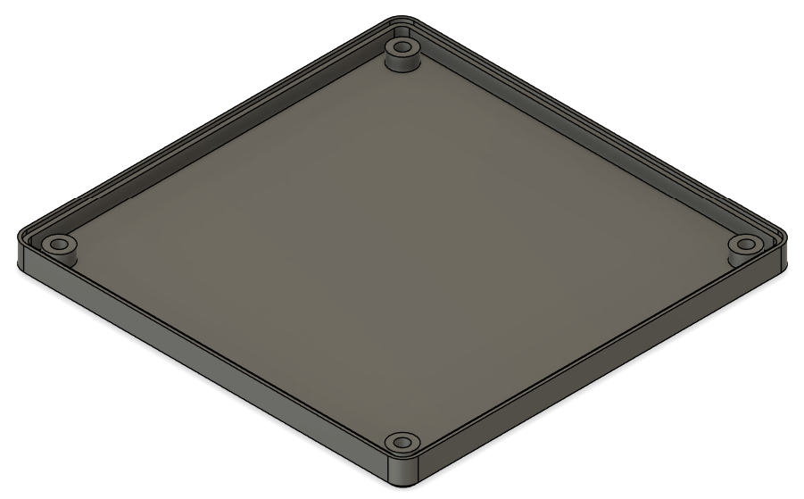
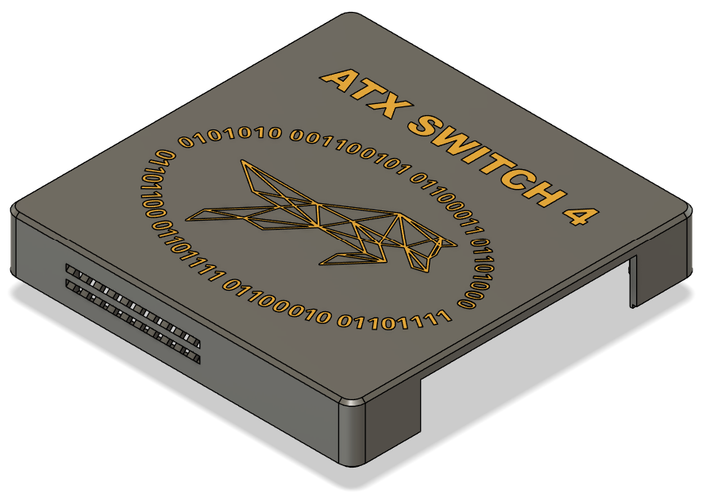
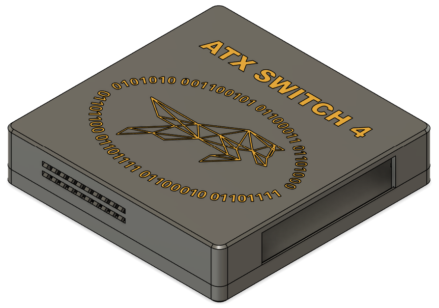
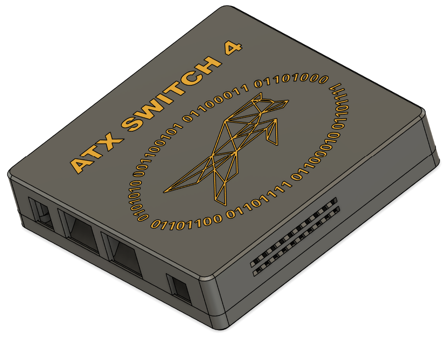
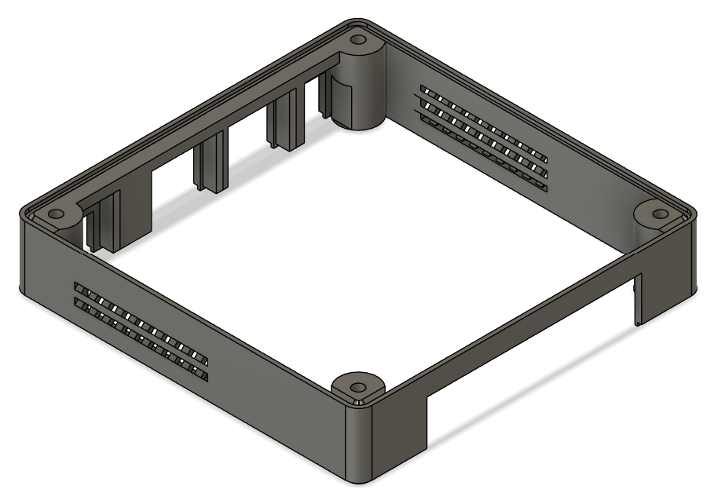
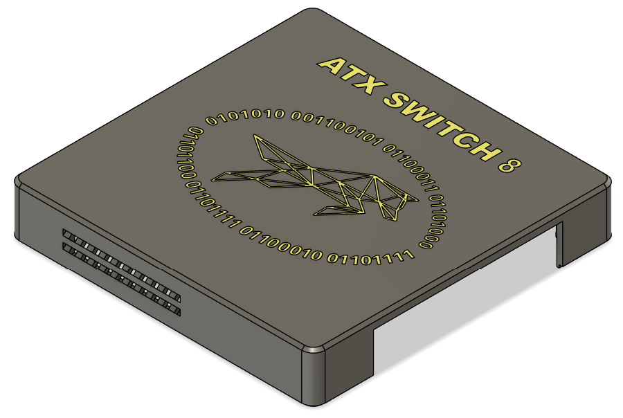
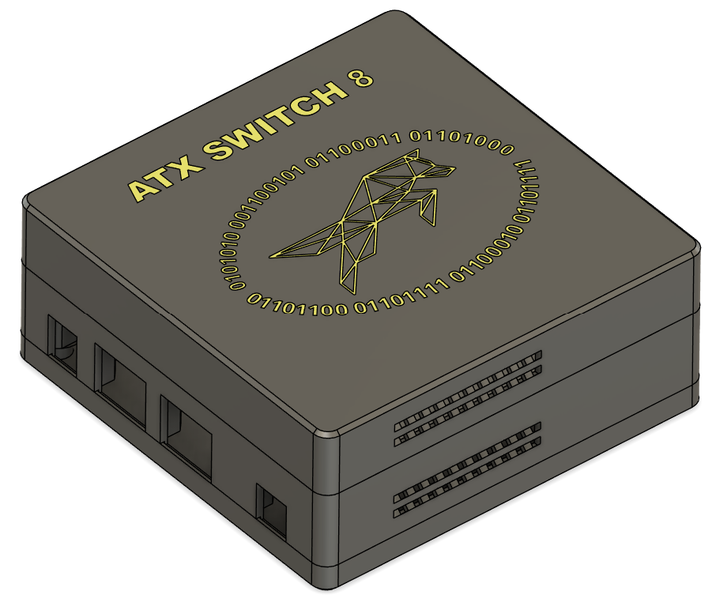
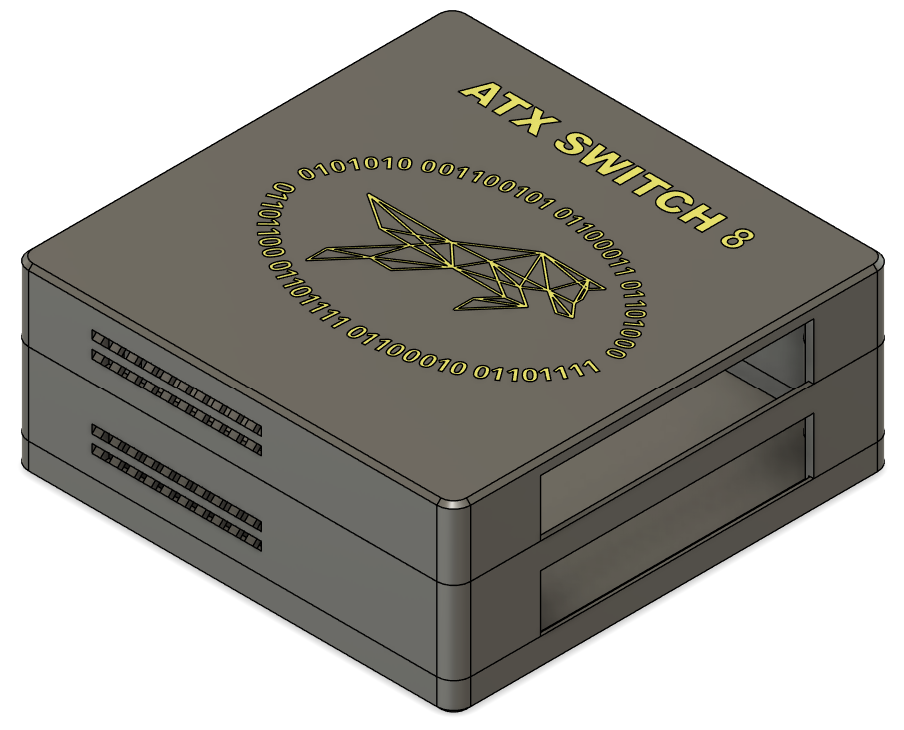

# ATX Switch Cases

3D printed case designs are available for both 4-port and 8-port ATX Switches

## 4-port - (ATX SWITCH 4)

|                |            |
| ------------------------------------------- | ----------------------------------------------------- |
|  |  |

Consists of:

- Printed in PLA
- Common base
- ATX Switch 4 top
  - Configured with cut-outs for the connectors on the main board and ventilation holes (not that the unit generates much heat)
  - Uses  [M3(OD4.5) 6mm heat inserts](https://www.aliexpress.com/item/1005006042691803.html?) within the support pillars to allow for repeated opening / closing. 

Case parts are fastened together with 4x 14mm countersunk black M3 bolts.

## 8-port - (ATX SWITCH 8)

|  |  |  |
| ----------------------------- | ------------------------------------ | --------------------------------- |

|  |  |
| ------------------------------------------- | ------------------------------------------- |

Consists of:

- Printed in PLA
- Common base
- Middle layer
  - Configured with cut-outs for the connectors on the main board and ventilation holes (not that the unit generates much heat)
- ATX Switch 8 top
  - Provides ventilation holes
  - Uses  [M3(OD4.5) 6mm heat inserts](https://www.aliexpress.com/item/1005006042691803.html?) within the support pillars to allow for repeated opening / closing.

Case parts are fastened together with 4x 35mm countersunk black M3 bolts.

>[!NOTE]
>The use of heat inserts is not compulsory but the inner diameter of the mounting hole on the pillars will probably need to be adjusted if M3 screws (or bolts) are to be used on their own.

>[!TIP]
>Case surface stability can be improved by attaching (4x) 10x2mm self adhesive rubber feet to the underside of the base in the indentations provided.

