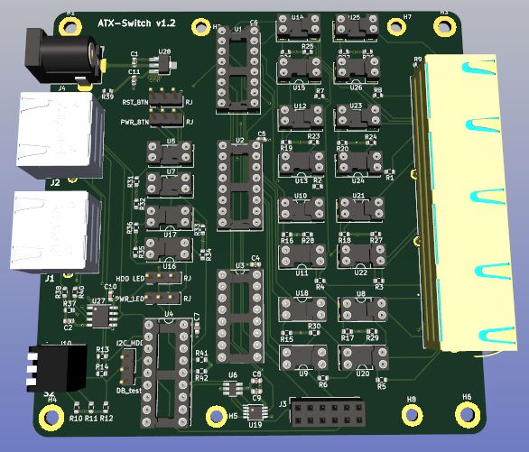
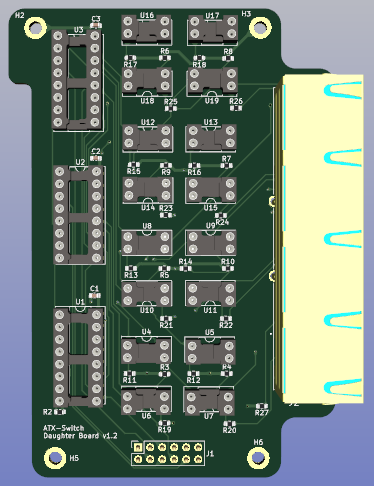

# ATX Switches (4 & 8 port)

## Design criteria

The ATX switches were designed with the following criteria in mind:

- Expandable - to support varying numbers of managed devices
- Isolation - to prevent damage between managed devices, and DIY PiKVM controller
- PiKVM compatibility - in so far as possible
- Simplicity
- Ease of construction / testing - assuming basic soldering skills
- Substitution - using pin compatible components. e.g. the user can decide whether to use SSRs or optocouplers (which are a fair bit cheaper) to provide the interface to the managed devices.
- Education / interest for me - tools / processes / techniques / vendors / components / etc.

As mentioned previously I originally had considered creating a solution based on a distributed MCU based architecture, but while the experimentation with this was interesting I eventually decided that it was more complex than was necessary for my purpose. I therefore decided to create a solution based on discrete components, with the communication between the PiKVM environment and the ATX Switch(es) being restricted to I2C and the relevant GPIO pins used for ATX operations.

> [!NOTE]
> At the time I started this exercise the only PiKVM available was the v3 (HAT and pre-built unit), with the main restriction being that it only supported 1080p @50Hz - and the majority of this functionality could be enabled via a v2 (DIY) approach.
> 
> Since then the v4 has been released with support for 1080p @60Hz, along with other features, which is not easily replicable with a DIY build (an approach that **is not** supported by the PiKVM team). So it is possible that a distributed (bus based) approach may have worked better in the long term...? However I still prefer the simplicity of the approach taken - perhaps a future expansion may be to produce a '*networked*' controller that can communicate between the PiKVM and the ATX Switch environment. OR maybe the PiKVM team will make the ATX port configurable...?     Anyway I digress.

The majority of HDMI KVM's that were being used within the community were 4-port or 8-port, as these were large enough for the bulk of home environments. Therefore I opted to create a 4-port main board that could be expanded to 8-ports by the addition of a daughter board - thus saving cost on some of the common components: Pi4 isolation (I2C and GPIO); I2C expander; power supply; Address selection switch; and various connectors. 

| Main Board                                | Daughter board                                |
| ----------------------------------------- | --------------------------------------------- |
|  |  |

However, being aware of larger HDMI KVM switches (and the ability to daisy-chain some HDMI KVM switches), I decided to design the ATX Switch to also allow expansion of the I2C and GPIO channels from the Pi4. 

An MCP23008 I2C I/O expander provides three address pins enabling 8x ATX Switches to be daisy-chained, giving a theoretical managed device capacity between 32 - 64 (**I've never tested to this capacity!**).

Signal isolation is provided on both the DIY PiKVM and managed device sides of the ATX Switch.

An RJ45 extender port (nearest to the power socket) enables the I2C and GPIO signals from the DIY PiKVM to be forwarded to the downstream ATX Switches in a daisy chained environment.

The pinout for the connection between the DIY PiKVM and the ATX Switch is custom (due to the signals required)[^1], however it does use the same GPIO pins as used within the PiKVM thus ensuring that ATX operations from within the WebUI are the same. Also the pinout used for the ports that connect to the managed devices is the same as that used by the PiKVM for its [ATX port](https://docs.pikvm.org/atx_board/#pinout).

Further criteria are covered in the [Main board](./Boards/Main_board/README.md) section.

## Required Parts

- [3D printed case](./Cases/README.md)
  - 4-port or 8-port variant
- [Main board](./Boards/Main_board/README.md) (4-port)
  - plus [Daughter board](./Boards/Daughter_board/README.md) (for 8-port)
- Power supply - 5V, 2.1mm barrel jack
- 4x M3 countersunk bolts[^2] (14mm for 4-port case, 35mm for 8-port case)
  
- 4x 10x2mm self adhesive rubber feet

## Installation / Operation

As designed, installation / operation of the ATX switch is straightforward, with most of the configuration complexity happening on the DIY PiKVM controller.

###### Basic PiKVM GPIO ATX operation

1. Set the internal jumpers on the [main board](./Boards/Main_board/README.md) before sealing the case.
   1. Currently, as I2C ATX operations are not supported yet, all jumpers (RST_BTN; PWR_BTN; HDD_LED; PWR_LED) should be set to 'RJ'.
   2. Set the remaining jumper to DB_test - this is a software configurable item which may not be used, but if I2C operations are not being used then the I2C_HDD functionality is not required.
2. Set the address of the ATX Switch using the address selection switch levers.
   1. If only one ATX Switch is to be deployed it is recommended that this be left at the default 0x20, however it can be changed provided that the matching address is configured in the **atx_switch_initialisation.yaml** file on the DIY PiKVM
3. Connect the output ports from the ATX Switch to the [ATX Adapter board](../ATX_Adapter_board/README.md) on the corresponding managed device using an 8-wire Ethernet cable[^3].
4. Connect the DIY PiKVM to the ATX Switch (RJ45 port nearest the address switch) via an 8-wire Ethernet cable[^3].
5. Plug in the 5V power supply.
   1. The green LED on the RJ45 port should illuminate.
6. When the DIY PiKVM is powered on / booted the amber LED on the RJ45 port should illuminate
   1. There is an option within the ATX Switch software (on the DIY PiKVM) to run a port test at initialisation. If this is configured then during the boot process the ATX Switch should cycle through port selection, which will be indicated by the port green LEDs switching on and off one at a time.

###### Extended (daisy-chain) operation

1. Perform the above steps for each switch, but in the case of the extra switches ensure that the address is set to a unique value (in the range 0x20 - 0x27).
2. Connect the switches together using 8-wire Ethernet cable(s) [^3]
   1. When power is applied then the downstream ATX Switches should have both the green and amber LEDs illuminated (on the DIY PiKVM RJ45 connector). This indicates that there is power to the ATX Switch (green), and that it is connected to the upstream switch (amber).
   2. The amber LED on the first ATX Switch in the chain will only be illuminated when the DIY PiKVM is powered-up / booted.

###### Custom I2C operation

The ATX Switch **can** support ATX operations using I2C commands, but not from the PiKVM WebUI environment currently. These need to be performed using Linux commands such as **i2cset / i2cget**.

In order to support this mode of operation the above steps still need to be performed but the internal jumpers need to be set to support I2C operations. i.e. moved away from the 'RJ' side to the other side.

If you want to get the HDD_LED status via I2C it is also necessary to switch the jumper from DB_test to I2C_HDD. This will lose the ability to test for presence of a daughter board, but this is less of an issue once the environment is operational.

The use of I2C for ATX operations also needs to be configured in the **atx_switch_initialisation.yaml** file on the DIY PiKVM (set **atx_ops** to **i2c**).

>[!NOTE]
>It is possible to have a mix of ATX Switches supporting standard GPIO and I2C operations in a daisy-chain (only one type per switch) - however this is an advanced use case.

###### Footnotes

[^1]: As the pinout of the PiKVM port is not configurable unfortunately
[^2]: Can use screws but will need to reduce size of affixing hole in case top.

[^3]: All Ethernet cables are to be straight (568B <--> 568B), not cross-over. All cable lengths should be kept to the minimum length possible to reduce likelihood of signal / power degradation.

