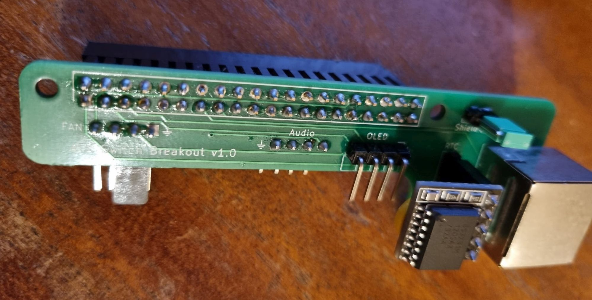

## ATX Connector board

This board provides an RJ45 connector that is mapped to the following GPIO pins to enable ATX Switch operation from a PiKVM enabled Pi4.

|  Function  |            Pi4 GPIO pin (physical)             | Pi4 (Logical) | RJ45 pin |
| :--------: | :--------------------------------------------: | :-----------: | :------: |
|   +3.3V    |            1 (but could also be 17)            |               |    1     |
|   Ground   | 6, 25, and 39 (but could be 9, 14, 20, 30, 34) |               |    2     |
| RST button |                       13                       |    GPIO 27    |    3     |
| PWR button |                       16                       |    GPIO 23    |    4     |
|  HDD LED   |                       15                       |    GPIO 22    |    5     |
|  PWR LED   |                       18                       |    GPIO 24    |    6     |
|  I2C SCL   |                       5                        |     GPIO3     |    7     |
|  I2C SDA   |                       3                        |    GPIO 2     |    8     |

The board is  **self-assembly** and includes connectors for a [mini RTC (Real Time Clock) module](https://www.aliexpress.com/item/32828162429.html) and the various elements included in the case:

- Pi4 GPIO expansion header
  - The design uses a [2x20 three layer heightened 2.54mm GPIO header](https://www.aliexpress.com/item/1005005366790021.html) to provide clearance to Pi4 USB3 / Ethernet connectors, and match up with the mounting slots in the case front.

- OLED header
- Fan (PWM enabled) header
  - [KF2510 3+1P male connector](https://www.aliexpress.com/item/1005002905132620.html) provided for keyed operation with Noctua NF-A4x10 5V PWM fan. Can also be used with 2-4pin fans using Dupont 2.54mm female connectors.
  - [4-pin SH1.0 connector](https://www.aliexpress.com/item/4001225684969.html) for use with suitable fans (e.g. new Pi5 40x40x10 PWM fan)
  - Note1 - PWM pin is grounded via 4.7Kohm resistor to enable fan to be stopped when PiKVM is halted.
  - Note2 - Tacho (RPM) pin is available but doesn't always seem to work reliably with PiKVM software (sometimes reports that fan is not working). I didn't investigate this exhaustively as PWM operation worked fine, so just ended up not configuring the 'hall_pin' in /etc/kvmd/fan.ini

- Audio header (from C790 HDMI-to-CSI adapter)

*Note - the alternative pins detailed for +3.3V and Ground are in case you want to wire up your own RJ45 connector.*
