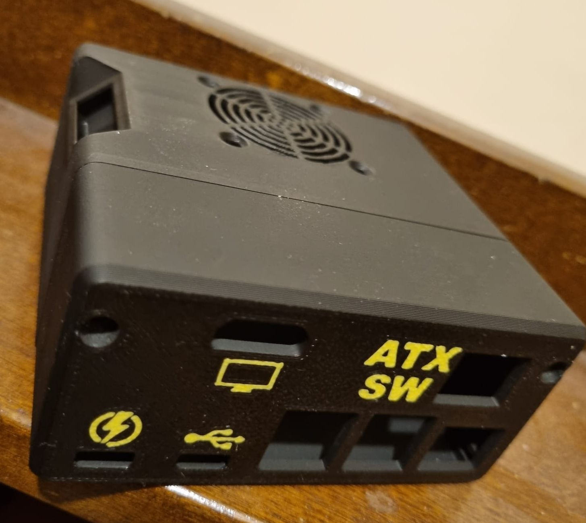

#### 3D printed Case for DIY PiKVM that supports ATX Switch operation

Printed in PLA the case supports:

- Pi4
- Power splitter from 8086.com
- C790 to provide HDMI-CSI video capture (and audio if required)
- ATX Switch connector (RJ45 configured with GPIO connectivity for ATX Switch)
- 40x40x10 fan

