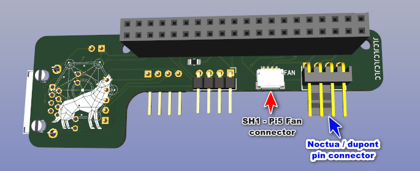

# DIY PiKVM Section

The *DIY PiKVM for ATX Switch* consists of:

## Hardware

- [3D printed case](./Case/README.md)
- Pi4 (suitable for PiKVM)
- [Power splitter](https://www.tindie.com/products/8086net/usb-cpwr-splitter/) from 8086.com
  - Barrel jack version not required, although will fit.

- [Angled USB-C cable](https://www.startech.com/en-gb/cables/r2ccr-15c-usb-cable) connecting Power splitter to Pi4 USC-C power supply port
  - Other cables / adaptors can potentially be used but I found this item to be best for the available space / bend.

- [C790](https://geekworm.com/products/c790) to provide HDMI-CSI2 video capture 
  - FPC 15-pin cable should also be supplied 
  - (audio if required using supplied I2S cable)

- [ATX Switch connector](./ATX_Switch_connector_board_for_Pi/README.md) (RJ45 configured with GPIO connectivity for ATX Switch)
- [0.91 inch OLED screen](https://www.aliexpress.com/item/1005005281308478.html) (typically white / yellow / blue)
  - 4-pin female-to-female dupont ribbon cable

- 4x 2mm silicone cushion mat self adhesive rubber feet
- **Optional** - 40x40x10 fan (preferably PWM). Few types tested:
  - [Noctua NF-A4x10 5V PWM](https://noctua.at/en/nf-a4x10-pwm)
  - [Pi5 PWM fan](https://thepihut.com/products/4010-cooler-black-fan-for-raspberry-pi-5?variant=42684803907779)
  - [GeeekPi PWM fan](https://www.amazon.co.uk/GeeekPi-Raspberry-Adjustable-40x40x10mm-Radiator/dp/B092ZF995F?th=1)
  - There are others, but not tested.

The case construction allows for mainly tool-less assembly, however the following bolts / connectors **are** used in the build of the unit:

- 2x M3 35mm bolts for connecting the front and back of the case together.
  - I used [black hex socket head bolts](https://www.aliexpress.com/item/1005005832717344.html) (to match in with the black PLA) together with [M3(OD4.5) 6mm heat inserts](https://www.aliexpress.com/item/1005006042691803.html) in the case back to provide a good fit that can be opened / closed easily. The use of heat inserts is not compulsory but the inner diameter of the mounting hole on the back case will probably need to be adjusted if M3 screws (or bolts) are to be used on their own.
- 4x M3 15mm bolts / nuts to fasten the fan into place
  - I used [black D4(M3) screw book binding post screws](https://www.aliexpress.com/item/32789781458.html) together with rubber washers to provide a good looking finish with the Noctua NF-A4x10 5V PWM fan.
- **Optional** - depending on preference, an M2.5 brass standoff spacer (18mm) can be used in conjunction with 2x M2.5 6mm low flat screws to fasten the ATX Switch connector board to the Raspberry Pi4. This is not essential as the case construction will hold the components together, but may provide rigidity during assembly.

### Hardware Assembly

1. Install the fan in the top of the case back

2. Attach the ATX Switch connector board to the Pi 4b GPIO header

   1. If desired affix the brass standoff spacer between the GPIO header and the Pi 4b Ethernet port
   1. Do **not** affix spacer at back of Pi4 and ATXCB as this will prevent the unit sliding into the supporting slots at the rear of the case.

3. Connect one end of the 4-pin female-to-female dupont cable to the OLED pins noting which dupont wire is connected to which OLED pin. Connect the other end of the dupont cable to the OLED connector on the ATX Switch connector board (ATXCB) - the pinout should be:

   

    | OLED Screen pins | ATXCB OLED connector       |
    | ---------------- | -------------------------- |
    | GND              | ${\textsf{\color{blue}L}}$ |
    | VCC              | ${\textsf{\color{blue}K}}$ |
    | SCL              | ${\textsf{\color{blue}J}}$ |
    | SDA              | ${\textsf{\color{blue}I}}$ |

4. Connect the straight end of the Angled USB-C cable to the single USB-C connector on the power splitter, and fit the power splitter into the case (should just slide in).

5. If audio is required then connect the dupont connectors from the cable supplied with the C790 to the relevant pins on the ATXCB. These are:

    | C790 I2S connector | Dupont connector | ATXCB connector           |
    | ------------------ | ---------------- | ------------------------- |
    | GND                | 1                | ${\textsf{\color{red}E}}$ |
    | WFS                | 2                | ${\textsf{\color{red}F}}$ |
    | SD                 | 3                | ${\textsf{\color{red}G}}$ |
    | SCK                | 4                | ${\textsf{\color{red}H}}$ |

    Connect the SH1 plug on the I2S cable to the socket on the C790. Refer to the [Geekworm wiki](https://wiki.geekworm.com/C790) for further details.

    Note - this has not been tested fully.

6. Connect the 15-pin FPC cable to the connector on the C790 (blue tag should be visible when viewing top of board).

7. Insert the C790 HDMI-to-CSI board into the slots on the inside front of the case with the HDMI connector located in the relevant (shaped) hole.

8. Place the Pi4 onto the bottom of the case back with the USB / Ethernet ports towards the front.

9. Connect the angled USB-C connector to the Power port (USB-C) to the rear left hand side of the Pi4.

10. Connect the Fan cable to the relevant header on the ATXCB

    

    1. If it is a Noctua fan then the plug is keyed which defines direction.

    2. If it is a Pi5 PWM fan then it connects to the SH1 connector, which is also directional.

    3. If a GeeekPi (or other generic) PWM fan is used then the Fans dupont wires can be connected to the same connector used by the Noctua with the following pinout:

       | GeeekPi (generic) PWM | Noctua / dupont connector   |
       | --------------------- | --------------------------- |
       | GND (Black)           | $\color{green}{\textsf{D}}$ |
       | +5V (Red)             | $\color{green}{\textsf{C}}$ |
       | PWM (Blue)            | $\color{green}{\textsf{A}}$ |

       If RPM wire is available then can try connecting this to pin $\color{green}{\textsf{B}}$​, but I had issues with getting this to work reliably so ended up only configuring the **fan.ini** file to support PWM operation (which worked fine).

11. Connect the free end of the 15-pin FPC cable into the Pi4 CSI port (blue tag towards the USB connectors).

12. Slide the Pi4 and ATXCB assembly into the slots in the front of the case (the USB and RJ45 connectors should nest into the relevant cut-outs in the case front).

13. Position the OLED screen into the relevant slot on the LHS of the case back, and gently slide the front and back of the case together, ensuring that the Pi4 slides into the supporting slots in the back of the case.

     1. It will be necessary to tuck in (/ fold) the various cables during this activity in order to get everything in without causing disconnections.
     2. Make sure that the FPC cable does not come out of its socket.
     3. It may be necessary to repeat this exercise a couple of times to get everything seated correctly.

14. Fasten the front and back of the case together with the M3 35mm bolts.

15. Once the software has been installed / configured, insert the SD card into the Pi4, power-up and test.

     

## Software

- [PiKVM v3 box software](https://files.pikvm.org/images/)
  - The latest image tested with is **v3-hdmi-rpi4-box-20240417.img.xz** with the following additions / modifications.
- [ATX Switch related](./Scripts/README.md)
  - python scripts
  - PiKVM configuration file changes
