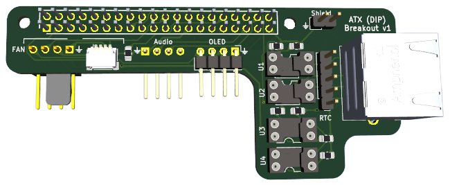
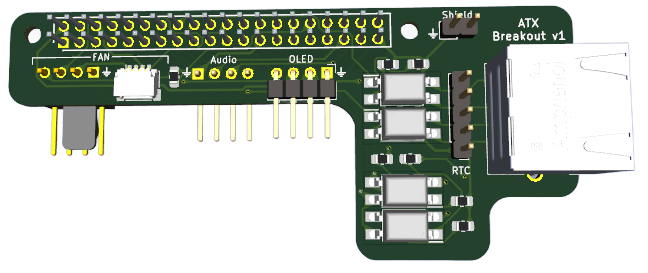

## ATX Connector board

Dip Variant

SMD Variant

Basically the same board with different choice of components / construction approach. In the case of the DIP variation you can use sockets (which I have a preference for) and decide which components to use (opto-couplers / SSR's) during installation. Although you can also dispense with the sockets and solder DIP components directly to PCB.

The board maps the following GPIO pins of the expansion header to the opto-isolators / SSR's to enable normal (single) ATX operation from a PiKVM enabled Pi4.

|  Function  | Pi4 GPIO pin (physical) | Pi4 (Logical) |
| :--------: | :---------------------: | :-----------: |
| RST button |           13            |    GPIO 27    |
| PWR button |           16            |    GPIO 23    |
|  HDD LED   |           15            |    GPIO 22    |
|  PWR LED   |           18            |    GPIO 24    |

The RJ45 header is mapped directly to the pinout used by PiKVM v3 / v4 units as defined in the ATXRJ-45 pinout at https://docs.pikvm.org/atx_board/

The board is  **self-assembly**, hosts the required opto-isolators / SSR's, and includes connectors for a [mini RTC (Real Time Clock) module](https://www.aliexpress.com/item/32828162429.html) and the various elements included in the case:

- Pi4 GPIO expansion header
  - The design uses a [2x20 three layer heightened 2.54mm GPIO header](https://www.aliexpress.com/item/1005005366790021.html) to provide clearance to Pi4 USB3 / Ethernet connectors, and match up with the mounting slots in the case front.

- OLED header
- Fan (PWM enabled) header
  - [KF2510 3+1P male connector](https://www.aliexpress.com/item/1005002905132620.html) provided for keyed operation with Noctua NF-A4x10 5V PWM fan. Can also be used with 2-4pin fans using Dupont 2.54mm female connectors.
  - [4-pin SH1.0 connector](https://www.aliexpress.com/item/4001225684969.html) for use with suitable fans (e.g. new Pi5 40x40x10 PWM fan)
  - Note1 - PWM pin is grounded via 4.7Kohm resistor to enable fan to be stopped when PiKVM is halted.
  - Note2 - Tacho (RPM) pin is available but doesn't always seem to work reliably with PiKVM software (sometimes reports that fan is not working). I didn't investigate this exhaustively as PWM operation worked fine, so just ended up not configuring the 'hall_pin' in /etc/kvmd/fan.ini

- Audio header (from C790 HDMI-to-CSI adapter)

