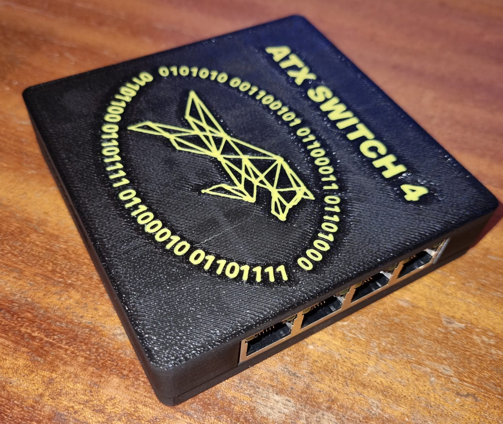
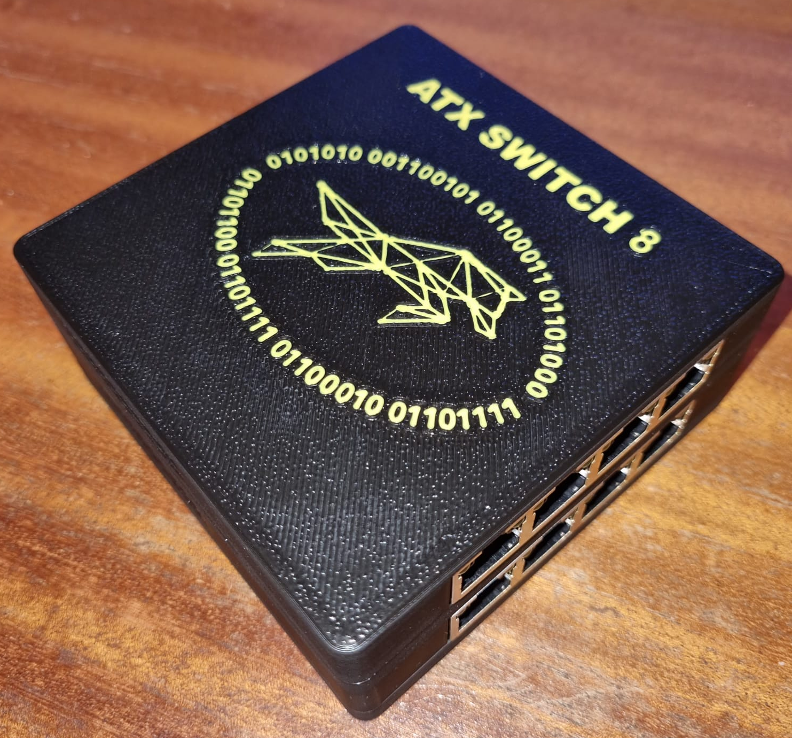
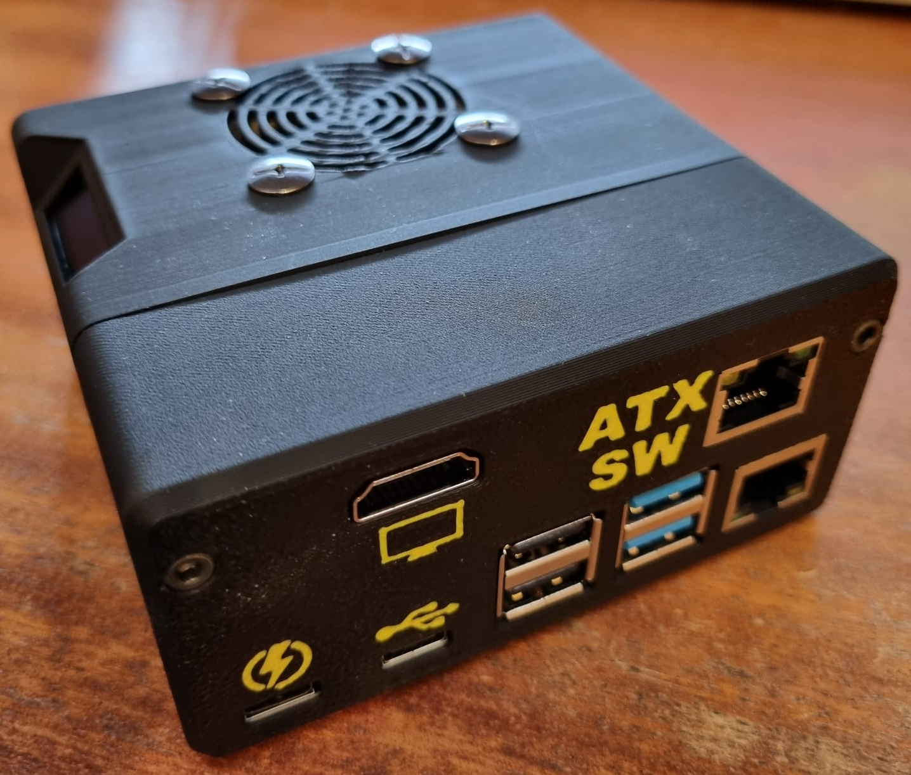
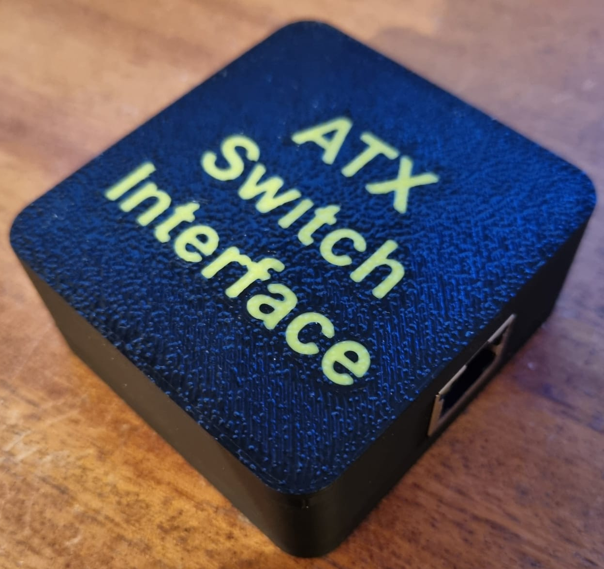
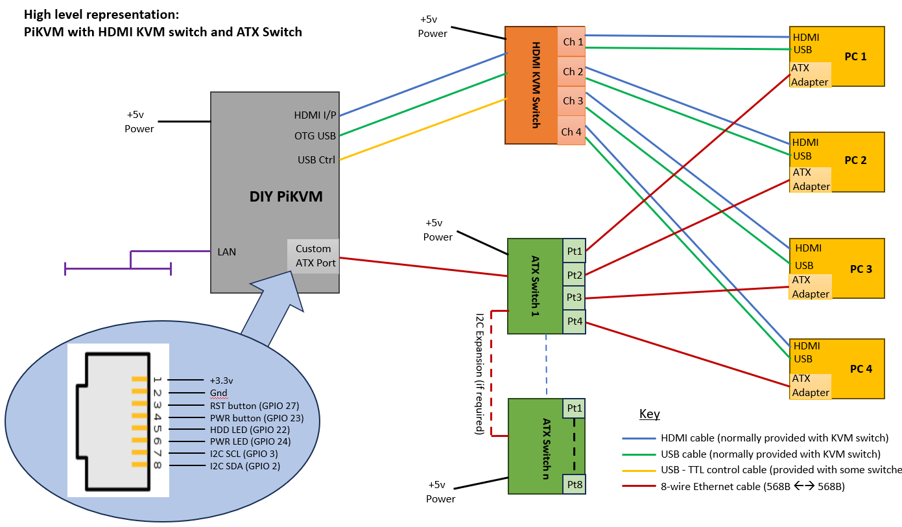
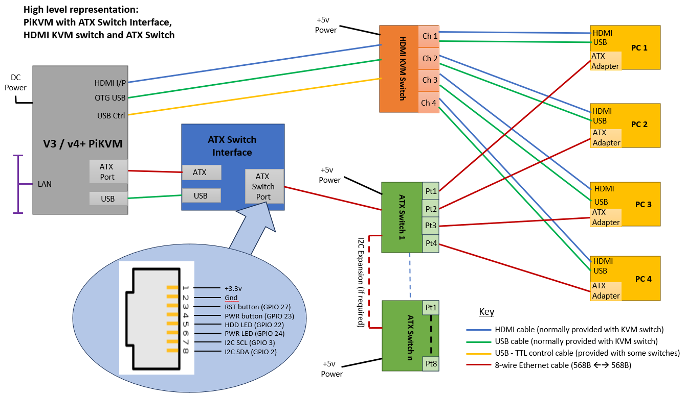
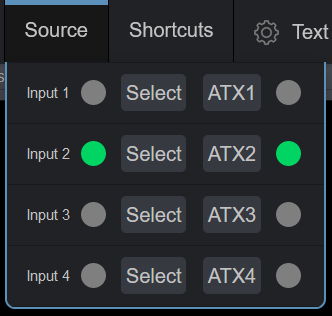

# ATX Switch

## Control ATX capability of multiple systems from PiKVM host

An extension unit to a [PiKVM](https://github.com/pikvm/pikvm) based controller that enables the WebUI based ATX controls (PWR button; Reset button; HDD LED and PWR LED) to be switched between the physical ATX headers, and their associated case controls, on different PC / Server motherboards.

Supports the control of multiple ATX-enabled endpoint devices, in conjunction with a KVM switch, from a single PiKVM unit.

>[!NOTE]
>An interface adaptor has now been produced that enables PiKVM v3 and v4 Plus devices to be connected to, and manage, an ATX Switch environment

|  |  |
| ------------------------------------------------------------ | ------------------------------------------------------------ |

## Features

- $\color{green}{\textsf{Low cost}}$ / **<u>self-assembly</u>**

- 4-port and 8-port units can be built
  - [Board / case designs available](https://github.com/techlobo/ATX_Switch/tree/main/ATX_Switches)
  
- I2C addressable (user selectable between 0x20 – 0x27)

- Daisy chainable (theoretically up to 8 units / 64 ports)

- Fully isolated

- Compatible with PiKVM assigned ATX GPIO pins

- Port selection controls available in WebUI (configurable via override.yaml)

- ATX operations use standard PiKVM WebUI interface

- Potential for ATX operations to be performed via I2C rather than GPIO (**not implemented yet**)

- Compatible with existing PiKVM based ATX adapter boards that are installed inside managed PC / workstation / server
  - Design available to build own [affordable ATX adapter board](https://github.com/techlobo/ATX_Switch/tree/main/ATX_Adapter_board)
  
- ATX Switch input port not compatible with existing v3 / v4 PiKVM hardware designs of ATX port due to requirement for providing control and power lines. Therefore cannot directly connect commercial PiKVM unit to ATX Switch. Two build approaches available:
  - [Low-cost DIY design](https://github.com/techlobo/ATX_Switch/tree/main/DIY_PiKVM) available based on v3 Box build (**self-assembly**)
  
    - 👀 Limited to 1080P @50Hz 👀
  
      

      
      

  
  - $\color{green}{\textsf{New addition}}$ - [ATX Switch Interface adaptor](./ATX_Switch_Interface_adaptor/README.md) (**self assembly**) enables connection between v2 / v3 / v4+ devices and ATX Switch environment.
  
    

    
    

  
  

## Typical deployments

##### $\color{purple}{\textsf{DIY PiKVM - most cost effective for home lab environments}}$

##### $\color{purple}{\textsf{Commercial PiKVM environments}}$

## Background

As PiKVM usage was developing, more users were wanting to extend its functionality to support multiple end-devices from a single PiKVM controller. This led to experimentation regarding the use of HDMI KVM switches to enable multiplexing of input / output streams between the devices.

This work by the community has led to a greater understanding of which HDMI KVM switches work best with PiKVM, and how to configure them. Some of this information has been [documented](https://docs.pikvm.org/multiport/) on the PiKVM site, whilst other information is available in the PiKVM discord server and various articles online.

However these approaches did not address one of the key capabilities of the PiKVM when used in a multi-device scenario - the ability to switch on / off the remote device, and to a lesser extent a visual confirmation of its power and HDD status.

I had just restarted an interest in hobby electronics and wanted an affordable solution for managing my home server environment,  so decided that this would be a good first project. 

I originally considered the construction of discrete '*intelligent*' controllers, using ESP32 (or similar) MCU's connected to the PiKVM via a bus based approach (e.g. Modbus, CANbus, MQTT). It was interesting testing these approaches out whilst determining how to: **design / build them** (e.g. component selection, PCB design, enclosure design); **deploy them** (e.g. where / how to install them, how to power them, how to communicate with them); and **manage them** (e.g. configuration / debug / maintenance). 

I learnt a lot during this exercise, but finally concluded that the approaches I was considering were more complicated than necessary, and that a simpler / more robust / cheaper solution could be produced just using devices based on discrete components connected directly to the PiKVM controller - hence the ATX Switches!

## Operation

When correctly configured, operation of the ATX Switch(es) is undertaken within the PiKVM WebUI. The means of this operation depends on how the system has been set up (see installation instructions).

### Managed device selection

This is performed within the **Source** menu option by either:

- activating the associated ATX(x) button, OR
- activating the associated Input(x) button if HDMI KVM switch integration has been performed. 

The selected port on the ATX Switch being indicated on the associated menu LED.

The video below gives a brief demonstration of the above activations, initially by using the ATXn selector buttons to switch between the managed devices - the associated LED (within the Source menu) changing to confirm selection complete. You can also see that the ATX menu LED icons change to indicate the status of the selected device (with ATX1 being powered off). The second part of the video shows selection of the target device using the Source menu 'Select' buttons which are mapped to the attached HDMI KVM switch. Observe how the selection of the KVM target causes the ATX Switch to be moved to the associated ATX interface.

<video src="./Images/PiKVM_ATX_op1.mp4"></video>

https://github.com/techlobo/ATX_Switch/assets/95144096/9a94704d-ef98-44f7-9990-24d5c0a44960

### ATX Functionality (via GPIO)

This is performed via the ATX menu in the WebUI, with the Power LED and HDD LED status for the selected device being indicated in the menu bar (*Note - this is all standard PiKVM functionality when GPIO controls are being used*).

The video below again shows the target device being selected from the Source Select buttons, but in this case the target device (4) is powered down. The completion of the LED representations in the Source menu shows that the 4th HDMI KVM port was selected alongside the ATX Switch 4th port. It can also be seen from the ATX menu that the status indications for Power and HDD are blank. On using the standard PiKVM ATX functionality to power on the target device it can be seen that the activity indicators start to operate, and the boot process is observed.

<video src="./Images/PiKVM_ATX_op2.mp4"></video>

https://github.com/techlobo/ATX_Switch/assets/95144096/6d380cd4-e1c7-4d97-97c2-12fe709a398f

The presentation of the Source menu is down to personal preference (as defined in the override.yaml file). It is not necessary to provide the ATX selection buttons, or indeed the selected ATX LEDs, if you are happy with just using one set of selection buttons, and having one set of 'selected' LEDs. Personally I prefer to show both sets of LEDs.

## Rough Costs

My approximate material costs for the final pieces of this project (not including IC sockets) were as shown below, on a pro-rata basis:

| Item                 |    Rough cost - own case (£)    | Rough cost - buy case (£) |
| -------------------- | :-----------------------------: | :-----------------------: |
| ATX Adapter board    | $\color{green}{\textsf{3.00}}$  |            N/A            |
| ATX Switch 4         | $\color{green}{\textsf{19.00}}$ |           39.00           |
| ATX Switch 8         | $\color{green}{\textsf{27.00}}$ |           51.00           |
| DIY PiKVM            | $\color{green}{\textsf{97.70}}$ |          119.70           |
| ATX Switch Interface | $\color{green}{\textsf{7.50}}$  |           26.00           |

>[!NOTE]
>The costs are based on the use of optocouplers for the ATX Switches. If SSRs were to be used then add at least an additional £10 to the cost of a 4-port, and £20 to an 8-port device.

A bit more detail is provided [here](./Rough_costs/README.md).

Some further savings can be made (e.g. cheaper fan, no fan at all, use of dupont cable rather than motherboard switch extender,....) but these are what I went with.

## Credits

None of the above would work without the amazing efforts of the developers of [PiKVM](https://pikvm.org/), and their support of the [Open Source community](https://github.com/pikvm). Hats off to them!

## Summary & Disclaimer

This is a synopsis of my adventures in this area while setting up management on my home lab environment. It works for me, but there are no guarantees it will for you. I've documented this primarily for my own benefit, including getting some idea of how Github and Markdown works. However, if you want to try something similar then please feel free to use any (*or none*) of the above material - $\color{red}{\textsf{at your own risk...!}}$
